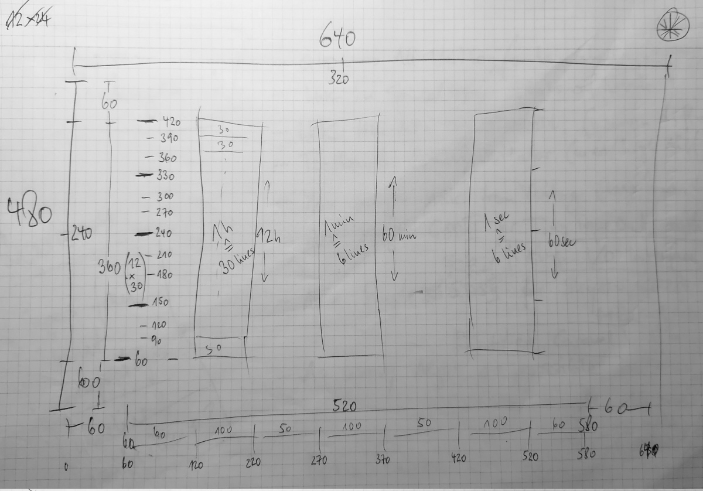

# VGA Clock for MPW 8

A mikrochip that shows a clock on a VGA display. 

### Tiny User Project

Template for submitting [TinyTapeout](https://tinytapeout.com) based projects to the [Open MPW shuttle](https://developers.google.com/silicon) program.

### Origin

1. [Proppys Tiny User Project Template](https://github.com/proppy/tiny_user_project/generate)

### VGA clock drawing

